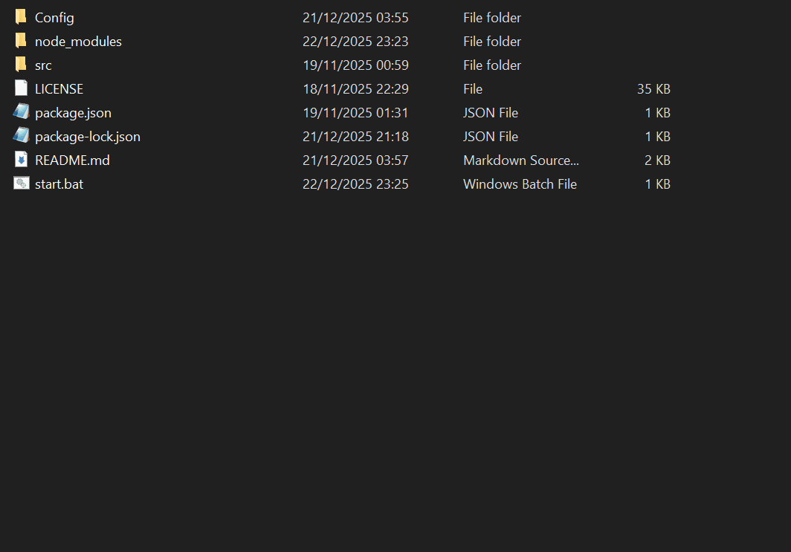

# About Soapbox Race World
Soapbox Race World is a revival of the popular multiplayer racing game "Need for Speed: World," which was originally released in 2010 and shutdown in 2015. The revival of "Need for Speed: World" as "Soapbox Race World" aims to bring back the classic racing gameplay and community experience of the original game.

You can find out more here: [https://soapboxrace.world/](https://soapboxrace.world/)
# About this program
This program exports your account data or someone else's data from your chosen Soapbox Race World server for offline use or archival purposes.

Compatible with Node.js v14.6.0 up to the latest version.
### Option 1
This is what the program exports if you choose to export your own data:
- Your Owned Cars (carslots.xml)
- Your Driver Info (GetPersonaInfo.xml & GetPersonaBase.xml)
- Your Achievements (loadall.xml)
- Your Inventory (objects.xml)
- Your Treasure Hunt Info (gettreasurehunteventsession.xml)
- Your Friends List (getfriendlistfromuserid.xml)
### Option 2
This is what the program exports if you choose to export someone else's data:
- Their Owned Cars (carslots.xml)
- Their Driver Info (GetPersonaInfo.xml & GetPersonaBase.xml)
### Everything will be saved into a folder called "Exported".
# How to use this program
1) Install [NodeJS](https://nodejs.org/en/).
2) Download and Extract SBRW Dumper to a safe location.
3) Go to `Config/config.json` in the directory you extracted SBRW Dumper into.
4) Open it, enter your email and password then save it.
5) Run "start.bat", some dependencies will be installed if it's your first time running this.
6) Select the correct server for your account and it should start exporting.
7) Once finished, there should be a folder called "Exported" which is where the account data will go for each server and persona (driver).
# Example of dumping your own data

# Example of dumping someone elses data

